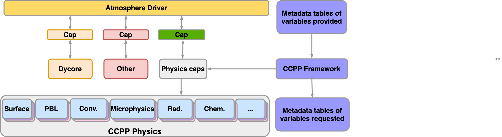

.. _Overview:

*************************
CCPP Overview
*************************

Ideas for this project originated within the Earth System Prediction Capability (ESPC)
physics interoperability group, which has representatives from the US National Center
for Atmospheric Research (NCAR), the Navy, National Oceanic and Atmospheric Administration
(NOAA) Research Laboratories, NOAA National Weather Service, and other groups. Physics
interoperability, or the ability to run a given physics :term:`suite` in various host models,
has been a goal of this multi-agency group for several years. An initial mechanism to
run the physics of NOAA’s Global Forecast System (GFS) model in other host models was
developed by the NOAA Environmental Modeling Center (EMC) and later augmented by the
NOAA Geophysical Fluid Dynamics Laboratory (GFDL). The :term:`CCPP` expanded on that work by
meeting additional requirements put forth by
`NOAA <https://dtcenter.org/gmtb/users/ccpp/developers/requirements/CCPP_REQUIREMENTS.pdf>`_,
and brought new functionalities to the physics-dynamics interface. Those include
the ability to choose the order of parameterizations, to subcycle individual
parameterizations by running them more frequently than other parameterizations,
and to group arbitrary sets of parameterizations allowing other computations in
between them (e.g., dynamics and coupling computations).

The architecture of the CCPP and its connection to a host model is shown in
:numref:`Figure %s <ccpp_arch_host>`.
There are two distinct parts to the CCPP: a library of physical parameterizations
(*CCPP-Physics*) that conforms to selected standards and an infrastructure (*CCPP-Framework*)
that enables connecting the physics to a host model.

.. _ccpp_arch_host:

   *Architecture of the CCPP and its connection to a host model,
   represented here as the driver for an atmospheric model (yellow box). The dynamical
   core (dycore), physics, and other aspects of the model (such as coupling) are
   connected to the driving host through the pool of physics caps. The CCPP-Physics is
   denoted by the gray box at the bottom of the physics, and encompasses the
   parameterizations, which are accompanied by physics caps.*

The host model needs to have functional documentation for any variable that will be
passed to or received from the physics. The :term:`CCPP-Framework` is used to compare the variables
requested by each physical :term:`parameterization` against those provided by the host model [#]_, and
to check whether they are available, otherwise an error will be issued. This process serves
to expose the variables passed between physics and dynamics, and to clarify how information
is exchanged among parameterizations. During runtime, the CCPP-Framework is responsible for
communicating the necessary variables between the host model and the parameterizations.

The :term:`CCPP-Physics` contains the parameterizations and suites that are used operationally in
the UFS Atmosphere, as well as parameterizations that are under development for possible
transition to operations in the future. The CCPP aims to support the broad community
while benefiting from the community. In such a CCPP ecosystem
(:numref:`Figure %s <ccpp_ecosystem>`), the CCPP can be used not only by the operational
centers to produce operational forecasts, but also by the research community to conduct
investigation and development. Innovations created and effectively tested by the research
community can be funneled back to the operational centers for further improvement of the
operational forecasts.

Both the CCPP-Framework and the CCPP-Physics are developed as open source code, follow
industry-standard code management practices, and are freely distributed through GitHub
(https://github.com/NCAR/ccpp-physics and https://github.com/NCAR/ccpp-framework).
This documentation is housed in repository https://github.com/NCAR/ccpp-doc.

.. _ccpp_ecosystem:

.. figure:: _static/CCPP_Ecosystem_Detailed-Diagram_only.png
   :align: center

   *CCPP ecosystem.*

The first public release of the CCPP took place in April 2018 and included all the
parameterizations of the operational GFS v14, along with the ability to connect to the
SCM. The second public release of the CCPP took place in August 2018 and additionally
included the physics suite tested for the implementation of GFS v15. The third public release of
the CCPP, in June 2019, had four suites: GFS_v15, corresponding to the GFS v15 model implemented operationally
in June 2019, and three developmental suites considered for
use in GFS v16 (GFS_v15plus with an alternate PBL scheme, csawmg with alternate convection and
microphysics schemes, and GFS_v0 with alternate convection, microphysics, PBL, and land surface schemes).
The CCPP v4 release, issued in March 2020, contains suite GFS_v15p2, which is an
updated version of the operational
GFS v15 and replaces suite GFS_v15. It also contains three developmental suites:
csawmg has minor updates, GSD_v1 is an update over the previously released GSD_v0,
and GFS_v16beta is the target suite for implementation in the upcoming operational GFSv16
(it replaces suite GFSv15plus). Additionally, there are two new suites,
GFS_v15p2_no_nsst and GFS_v16beta_no_nsst,  which are variants that treat the
sea surface temperature more simply. These variants are recommended for use when the initial conditions
do not contain all fields needed to initialize the more complex Near Sea Surface
Temperature (NSST) scheme. The `CCPP Scientific Documentation
<https://dtcenter.org/GMTB/v4.0/sci_doc/suite_FV3_GFS_v15p2_xml.html>`_ describes
the suites and their parameterizations in detail.

The CCPP is governed by the groups that contribute to its development. The governance
of the CCPP-Physics is currently led by NOAA, and the DTC works with EMC and the Next
Generation Global Prediction System (NGGPS) Program Office to determine which schemes
and suites to be included and supported. The governance of the CCPP-Framework is jointly
undertaken by NOAA and NCAR (see more information at https://github.com/NCAR/ccpp-framework/wiki
and https://dtcenter.org/gmtb/users/ccpp). Please direct all inquiries to gmtb-help@ucar.edu.

.. _scheme_suite_table:

.. table:: Suites supported in the CCPP

   +--------------------+-----------------+--------------------------------------------------+---------------------------------------------------+
   |                    | **Operational** |                  **Experimental**                |                 **Variants**                      |
   +====================+=================+=================+=============+==================+=========================+=========================+
   |                    | **GFS_v15p2**   | **GFS_v16beta** | **csawmg**  | **GSD_v1**       | **GFS_v15p2_no_nsst**   | **GFS_v16beta_no_nsst** |
   +--------------------+-----------------+-----------------+-------------+------------------+-------------------------+-------------------------+
   | Microphysics       | GFDL            | GFDL            | M-G3        | Thompson         | GFDL                    | GFDL                    |
   +--------------------+-----------------+-----------------+-------------+------------------+-------------------------+-------------------------+
   | PBL                | K-EDMF          | TKE EDMF        | K-EDMF      | saMYNN           | K-EDMF                  | TKE EDMF                |
   +--------------------+-----------------+-----------------+-------------+------------------+-------------------------+-------------------------+
   | Deep convection    | saSAS           | saSAS           | CSAW        | GF               | saSAS                   | saSAS                   |
   +--------------------+-----------------+-----------------+-------------+------------------+-------------------------+-------------------------+
   | Shallow convection | saSAS           | saSAS           | saSAS       | saMYNN and saSAS | saSAS                   | saSAS                   |
   +--------------------+-----------------+-----------------+-------------+------------------+-------------------------+-------------------------+
   | Radiation          | RRTMG           | RRTMG           | RRTMG       | RRTMG            | RRTMG                   | RRTMG                   |
   +--------------------+-----------------+-----------------+-------------+------------------+-------------------------+-------------------------+
   | Surface layer      | GFS             | GFS             | GFS         | GFS              | GFS                     | GFS                     |
   +--------------------+-----------------+-----------------+-------------+------------------+-------------------------+-------------------------+
   | Gravity Wave Drag  | uGWD            | uGWD            | uGWD        | uGWD             | uGWD                    | uGWD                    |
   +--------------------+-----------------+-----------------+-------------+------------------+-------------------------+-------------------------+
   | Land surface       | Noah            | Noah            | Noah        | RUC              | Noah                    | Noah                    |
   +--------------------+-----------------+-----------------+-------------+------------------+-------------------------+-------------------------+
   | Ozone              | NRL 2015        | NRL 2015        | NRL 2015    | NRL 2015         | NRL 2015                | NRL 2015                |
   +--------------------+-----------------+-----------------+-------------+------------------+-------------------------+-------------------------+
   | H\ :sub:`2`\ O     | NRL 2015        | NRL 2015        | NRL 2015    | NRL 2015         | NRL 2015                | NRL 2015                |
   +--------------------+-----------------+-----------------+-------------+------------------+-------------------------+-------------------------+
   | Ocean              | NSST            | NSST            | NSST        | NSST             | sfc_ocean               | sfc_ocean               |
   +--------------------+-----------------+-----------------+-------------+------------------+-------------------------+-------------------------+

*The suites that are currently supported in the CCPP are listed in the second row. The
types of parameterization are denoted in the first column, where H2O represents the stratospheric water
vapor parameterization. The GFS_v15p2 suite includes the GFDL microphysics, a Eddy-Diffusivity Mass
Flux (K-EDMF) planetary boundary layer (PBL) scheme, scale-aware (sa) Simplified Arakawa-Schubert
(SAS) convection, Rapid Radiation Transfer Model for General Circulation Models (RRTMG) radiation,
the GFS surface layer, the unified gravity wave drag (uGWD), the Noah Land Surface Model (LSM),
the 2015 Navy Research Laboratory (NRL) ozone and stratospheric water vapor schemes, and the
NSST ocean scheme. The three developmental suites are candidates for future operational implementations. The GFS_v16beta
suite is the same as the GFS_v15p2 suite except using the Turbulent Kinetic Energy (TKE)-based EDMF
PBL scheme. The Chikira-Sugiyama (csawmg) suite uses the Morrison-Gettelman 3 (M-G3) microphysics
scheme and Chikira-Sugiyama convection scheme with Arakawa-Wu extension (CSAW). The NOAA Global
Systems Division (GSD) v1 suite (GSD_v1) includes Thompson microphysics,
scale-aware Mellor-Yamada-Nakanishi-Niino (saMYNN) PBL and shallow convection, Grell-Freitas (GF) deep
convection schemes, and the Rapid Update Cycle (RUC) LSM. The two variants use the
sfc_ocean scheme instead of the NSST scheme.*

.. [#] As of this writing, the CCPP has been validated with two host models: the CCPP
    Single Column Model (SCM) and the atmospheric component of
    NOAA’s Unified Forecast System (UFS) (hereafter the UFS Atmosphere) that utilizes
    the Finite-Volume Cubed Sphere (FV3) dycore. The CCPP can be utilized both with the
    global and standalone regional configurations of the UFS Atmosphere. The CCPP
    has also been run experimentally with a Navy model. Work is under
    way to connect and validate the use of the CCPP-Framework with NCAR models.

.. include:: Introduction.rst
